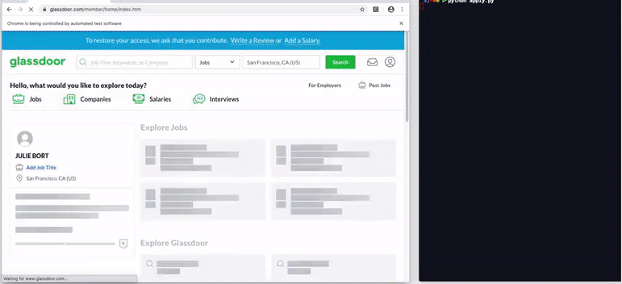

# Intern Bot 👩🏾‍💻

A script to automatically search Glassdoor for job listings, aggregate every application URL, and apply to each job using pre-populated data. ***All with one click!***
The resume used in the repository is for demo and has been downloaded from internet for educational purpose.

## Inspiration
Ever sit at your desk for hours, clicking through endless job listings hoping to strike gold with one response? To solve this, I made a script a few months ago, with one click, this script automatically fills out generic software engineering job applications through Greenhouse and Lever! With this app, we can scrape the entire job search results page on Glassdoor, aggregate all the job application URLs, and feed them into the Intern bot to apply to! ✨

## Installation
1. Install Selenium: `pip install selenium`
2. Install BeautifulSoup: `pip install beautifulsoup4`

## Usage
#### To test `job_list.py`
1. Uncomment the last line `job_list.py`
2. Run `$ python job_list.py`

#### To run the entire script:
1. Set a number of pages you'd like to iterate through here
2. Upload your Resume 
3. Fill Choices in job_list.py at line 17
4. FIll Information in autofill.py at line 13
5. Run `$ python autofill.py`
6. The script opens [glassdoor.com](https://www.glassdoor.com/index.htm), log-in
7. From there on, everything is automatic!

## Thanks

* [Selenium](https://selenium-python.readthedocs.io/) - A portable framework for testing web applications, provides a playback tool for authoring functional tests without the need to learn a test scripting language.
* [Beautiful Soup](https://www.crummy.com/software/BeautifulSoup/doc) - A tool to scrape HTML/XML content.

## License

This project is licensed under the MIT License - see the [LICENSE.md](https://github.com/SinghHimadri/Autofill_glassdoor_script/blob/master/LICENSE.md) file for details.
